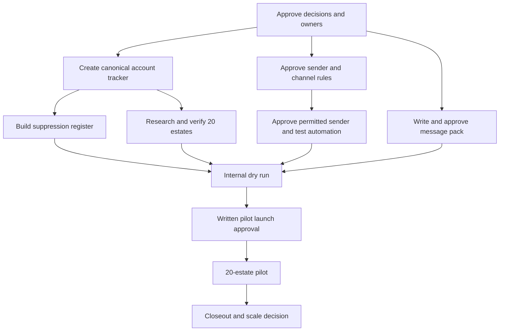

# GardenSuite Outreach Restart Master Plan

**Version:** v1 draft  
**Prepared for:** Sarbani Associates  
**Date:** 2026-08-05  
**Status:** Implementation plan, not launch approval

## 1. Executive summary

The immediate goal is to build a safe, account-based outbound motion for GardenSuite's attendance offering. The first audience is independently managed tea estates of 50 hectares or more in West Bengal and Assam. Big corporate groups are excluded. The first contact should be a founder, owner, director, general manager, estate manager, or garden manager.

The first channel is email. Snov.io Campaigns is selected for the 20-estate cold-email pilot. It will connect to the existing domain mailbox through SMTP/IMAP and automate follow-ups. No Google Workspace purchase is required. Brevo remains available only for opted-in marketing. WhatsApp is a later follow-up only when the permission or relationship gate is satisfied. LinkedIn remains outside the first pilot.

The plan has three core bets:

1. **Research quality before volume.** A small list of correctly qualified estates is more useful than a large list with unknown ownership, acreage, roles, or current contact details.
2. **One account record before automation.** Every estate, contact, message, reply, suppression, and next step must be visible in one canonical system before a campaign tool is selected.
3. **A controlled pilot before scale.** Twenty estates are enough to test data quality, message relevance, sender health, and the demo handoff. The result can guide the next batch without treating a small pilot as proof of a permanent conversion rate.

The current binding constraint is not message volume. It is readiness: open strategy decisions, missing qualification fields, no selected system of record, no verified sender setup, and no approved message pack.

## 2. Objective and boundaries

### Primary objective

Generate qualified replies and free-demo conversations for GardenSuite face attendance from suitable tea estates.

### Primary value story

- Worker identity is checked by face scan before hazira is recorded.
- Attendance works offline in field conditions.
- Records sync when internet returns.
- Office staff can review records before payroll work.
- Sarbani Associates installs the system, trains staff, and supports rollout.

Use `helps stop proxy attendance`. Do not claim that proxy attendance is eliminated.

### Pilot audience

- West Bengal or Assam
- Tea garden or tea estate
- At least 50 hectares
- Not on the approved corporate exclusion list
- At least one verified contact in an approved role

### Excluded work

- retired campaign imports or automations
- mass WhatsApp outreach
- lead-capture reactivation
- paid advertising
- LinkedIn automation
- public use of client names without approval
- unsupported accuracy, ROI, or time-saving claims

## 3. Current state

### Existing strengths

- GardenSuite has a clear tea-garden-specific attendance offering.
- The attendance website and detail pages exist.
- Sarbani Associates provides on-site setup, training, and support.
- The estate-account consolidation model already prevents treating every phone or email as a separate lead.
- Product language, proof limits, and confidentiality rules are documented.

### Current gaps

- The dated estate snapshot does not contain hectares, ownership group, contact name, or contact title.
- Broad location values are not enough to prove West Bengal or Assam eligibility for every account.
- Big corporate groups are excluded, but no exact rule or named list exists.
- Pipeline stages, named owners, sender identity, cadence, system of record, and pilot rules are proposed, not approved.
- The `gardensuite.in` domain has a current mail host, but SMTP/IMAP access, TLS, and mailbox login are not verified.
- No SPF or DMARC record was found during the 2026-08-05 DNS check. DKIM also needs verification.
- The Snov.io account, sender identity, campaign, exit rules, and activity logging still need setup and testing.
- The final outbound message pack does not exist under the current strategy.

## 4. Operating principles

1. One tea estate account can have several contacts, but only one account status.
2. No person is contacted until account fit, contact role, source, and suppression are verified.
3. No message is sent from a legacy queue simply because it is marked reviewed.
4. Email is the first channel.
5. Silence on email is not permission for cold WhatsApp.
6. Every follow-up adds a new practical point.
7. Every positive reply has a named owner and next action.
8. Every stop request is applied before another send can occur.
9. Replies and demos matter more than opens.
10. A pilot can be paused by safety or data-quality failure even if reply results look promising.

## 5. Dependency flow

## 6. Phased implementation

### Phase 0 - Governance and decisions

**Goal:** Close the decisions that affect every downstream system.

Tasks:

- [ ] Close O-001 through O-013 in [`DECISIONS.md`](DECISIONS.md), or mark non-blocking decisions with a due date
- [ ] Name the outreach owner and backup
- [ ] Name the demo and sales owner and backup
- [ ] Approve the corporate exclusion workflow
- [ ] Approve the WhatsApp permission gate
- [ ] Approve the pilot size and success rules
- [ ] Set a pilot budget cap
- [ ] Record who can authorize a launch, pause, resume, and scale decision

Exit gate: G0

### Phase 1 - System of record and data foundation

**Goal:** Create one clean account-based operating record.

Tasks:

- [ ] Select a controlled workbook or CRM
- [ ] Create Accounts, Contacts, Activities, Suppression, Message Versions, and Pilot Batches structures
- [ ] Assign permanent account and contact IDs
- [ ] Add required validation values for state, role, stage, outcome, and suppression reason
- [ ] Add source and verified-date fields
- [ ] Define deduplication and merge rules
- [ ] Test the tracker with three sample estates
- [ ] Confirm that a suppressed contact cannot be placed in a send-ready view
- [ ] Record one accountable editor and backup process

Exit gate: G1

### Phase 2 - Qualification and enrichment

**Goal:** Produce a 20-estate pilot batch that fully matches the confirmed audience.

Tasks:

- [ ] Build a larger research pool so rejected estates can be replaced
- [ ] Verify West Bengal or Assam location
- [ ] Verify at least 50 hectares with a dated source
- [ ] Verify current ownership or controlling group
- [ ] Apply the approved corporate exclusion list
- [ ] Verify at least one target-role contact
- [ ] Verify the email address before use
- [ ] Search the master suppression register
- [ ] Add a second reviewer for every pilot account
- [ ] Freeze the approved pilot batch with an export date and version

Exit gate: G3

### Phase 3 - Sender, deliverability, and compliance controls

**Goal:** Make sure the sender can deliver and stop safely.

Tasks:

- [ ] Select the named domain sender and mailbox for Snov.io
- [ ] Verify SMTP, IMAP, TLS, SPF, DKIM, and DMARC
- [ ] Connect the sender mailbox to Snov.io Campaigns
- [ ] Build one approved attendance campaign in Snov.io
- [ ] Test reply, unsubscribe, bounce, and manual-stop exits
- [ ] Verify SPF, DKIM, DMARC, TLS, and domain alignment as applicable
- [ ] Confirm the mailbox can receive replies and is checked during business hours
- [ ] Confirm visible opt-out wording and unsubscribe handling
- [ ] Confirm hard bounces automatically suppress the address or are processed before the next send
- [ ] Confirm complaint and stop-request handling
- [ ] Confirm WhatsApp is disabled for contacts without the approved permission condition
- [ ] Complete legal and compliance review for the intended channels
- [ ] Warm the mailbox if it is new or inactive
- [ ] Run inbox-placement and reply-path tests

Exit gates: G2 and G5

### Phase 4 - Message and sales readiness

**Goal:** Approve a short message pack and a clear path from reply to demo.

Tasks:

- [ ] Write one short attendance sequence for all approved roles
- [ ] Prepare three email touches
- [ ] Give every touch one new practical angle
- [ ] Use one low-friction reply question
- [ ] Use only approved proof and claims
- [ ] Include Sarbani Associates as the setup and support trust anchor
- [ ] Prepare positive, referral, not-now, objection, and stop-response templates
- [ ] Prepare a demo brief and handoff form
- [ ] Review every message for simple English and tea-garden vocabulary

Exit gate: G4

### Phase 5 - Internal dry run

**Goal:** Prove that the whole process works without contacting a prospect.

Tasks:

- [ ] Create an internal seed list using team-controlled inboxes
- [ ] Run the exact send-ready workflow without external recipients
- [ ] Confirm required contact fields and approved fallbacks work
- [ ] Confirm replies reach the monitored inbox
- [ ] Confirm each activity appears in the system of record
- [ ] Test unsubscribe, stop, bounce, and suppression flows
- [ ] Test a positive reply handoff to the demo owner
- [ ] Test a pause command and prove no further sends occur
- [ ] Record defects, fixes, and evidence

Exit gate: G6

### Phase 6 - Twenty-estate pilot

**Goal:** Test relevance and operational control on a small, verified account set.

Tasks:

- [ ] Record written G7 launch approval
- [ ] Add one primary contact per estate to the approved automation only after provider eligibility passes
- [ ] Let the approved automation send only within the approved days, hours, and daily cap
- [ ] Log every send, reply, suppression, and next action
- [ ] Handle replies within the approved SLA
- [ ] Pause immediately on any hard bounce, spam complaint, suppression failure, or wrong-person pattern
- [ ] Stop an account sequence after any meaningful reply
- [ ] Send the final close-the-loop email only if no stop condition applies
- [ ] Freeze results after all accounts complete or exit

Exit gate: G8

### Phase 7 - Review and controlled scale

**Goal:** Decide whether to stop, repair, repeat, or expand.

Tasks:

- [ ] Recheck qualification accuracy
- [ ] Review delivery, bounce, reply, positive reply, demo, opt-out, and complaint results
- [ ] Review results by state, role, message version, and source
- [ ] Read replies for objections and customer language
- [ ] Document what changed from the original hypothesis
- [ ] Decide `Stop`, `Repair`, `Repeat 20`, or `Scale` with a written reason
- [ ] Set a new account cap and safety limits if scaling
- [ ] Do not add LinkedIn or broader WhatsApp use inside the same decision

Exit gate: G9

## 7. Suggested 90-day schedule

The dates depend on owner decisions, research capacity, and sender warmup. Weeks can move, but gates cannot be skipped.

| Period | Focus | Required outcome |
|---|---|---|
| Week 1 | Decisions and ownership | G0 passed |
| Week 2 | System of record and suppression | G1 and core G2 controls passed |
| Weeks 2-3 | Estate and contact research | Candidate pool built |
| Weeks 3-4 | Sender setup and message pack | G4 and G5 passed or sender warmup underway |
| Weeks 4-5 | Pilot-batch QA and internal dry run | G3 and G6 passed |
| Weeks 6-9 | Pilot sequence | G7 active, daily checks completed |
| Week 10 | Pilot closeout | G8 passed |
| Weeks 11-12 | Fixes and decision | G9 decision recorded |

If a new domain or mailbox needs longer warmup, move the pilot. Do not compress sender preparation to keep the calendar.

## 8. Ownership model

| Work | Responsible | Accountable | Consulted | Informed |
|---|---|---|---|---|
| Strategy decisions | Named strategy owner | Sarbani Associates owner | Outreach and demo owners | Team |
| Estate research | Researcher | Outreach owner | Second reviewer | Demo owner |
| Contact verification | Researcher | Outreach owner | Second reviewer | Team |
| System of record | Tracker administrator | Outreach owner | Technical owner | Demo owner |
| Message writing | Copy owner | Business approver | Product and claim reviewer | Outreach owner |
| Sender setup | Technical owner | Sarbani Associates owner | Sending provider | Outreach owner |
| Compliance and suppression | Compliance owner | Sarbani Associates owner | Technical and outreach owners | Team |
| Snov.io campaign operation | Outreach owner | Sarbani Associates owner | Technical owner | Demo owner |
| Positive reply | Outreach owner | Demo owner | Product owner | Team |
| Demo and evaluation | Demo owner | Sarbani Associates owner | Product and technical owners | Outreach owner |
| Pilot review | Outreach owner | Sarbani Associates owner | Demo, data, and technical owners | Team |

Named people must replace role labels before G0 passes.

## 9. Risk register

| Risk | Early signal | Control | Owner |
|---|---|---|---|
| Wrong estates enter pilot | Missing acreage or ownership source | Binary qualification gate and second review | Outreach owner |
| Big corporate group contacted | Ownership is unclear | Manual Review and named exclusion list | Strategy owner |
| Wrong person contacted | Generic inbox or title not verified | Role proof required before Qualified | Research owner |
| Duplicate outreach to one estate | Several contacts scheduled together | Account-level send lock | Tracker administrator |
| Suppressed contact messaged | Import bypasses suppression | Pre-send suppression join and dry-run test | Compliance owner |
| Sender reputation damage | Bounce, complaint, spam placement | Authentication, verification, warmup, immediate pause | Technical owner |
| Message sounds generic | Same copy fits unrelated industries | Tea-garden vocabulary and attendance-specific copy test | Copy owner |
| Unsupported claims | Accuracy, savings, or client names appear | Claim checklist and business approval | Product reviewer |
| Positive reply goes cold | No owner or next action | Four-business-hour SLA and backup owner | Demo owner |
| Legacy automation activates | Old list or template referenced | Current-strategy check and change review | Strategy owner |
| Small pilot overinterpreted | Opens or one reply treated as proof | Use reply quality and repeat test before scale | Pilot reviewer |

## 10. Definition of done

The outreach restart project is complete when:

- G0 through G8 have passed with evidence
- all 20 pilot accounts have a final outcome
- no activity is missing from the canonical tracker
- every opt-out, bounce, complaint, and do-not-contact result is in suppression
- the pilot review states what worked, what failed, and what changes next
- a written G9 decision sets the next action and maximum volume
- `CURRENT_STRATEGY.md` is updated with approved decisions
- the plan and strategy documents are committed to version control
