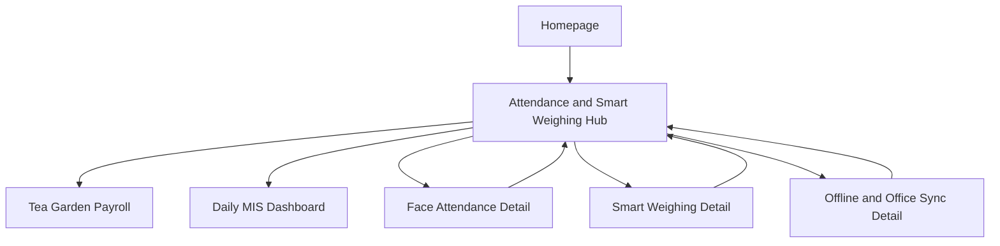

# GardenSuite Attendance Page Build Plan

**Status:** Approved direction, ready for implementation
**Primary route:** `/products/attendance`
**Primary conversion:** Book Free Demo
**Secondary conversion:** Email Us
**Approved wireframe:** `../wireframes/attendance-product-wireframe.html`
**Detailed distribution map:** `attendance-content-distribution.md`
**Product source of truth:** `.agents/product-marketing.md` and the feature documentation in `gs_face` and `gs_web`

## 1. Outcome

Replace the current long attendance page with a short decision page that helps a tea garden owner or manager understand five things quickly:

1. GardenSuite verifies the worker by face.
2. Attendance or leaf weight stays linked to that worker.
3. Field records can be saved without dependable internet.
4. Office staff can review the records in GardenSuite.
5. Sarbani Associates installs, trains, and supports the garden.

The page should create enough confidence to book a demo. It should not teach every feature.

## 2. Success definition

The page is successful when:

- A first-time visitor can explain the product after the hero and workflow.
- The page contains no more than about 650 visible words before the footer.
- The main field-to-office story is supported by real product captures.
- Homepage trust signals appear without creating a separate long proof section.
- A visitor can reach the demo action from the hero and final CTA.
- Detailed features have an assigned future destination instead of being added to the hub.
- The route meets all project SEO, performance, copy-safety, accessibility, and responsive rules.

Do not set a conversion-rate target until the current page has a measured baseline.

## 3. Non-negotiable boundaries

### Show

- Face verification.
- Attendance and smart weighing in one field flow.
- Offline saving and later office sync.
- GS Face in the field and GardenSuite MIS in the office.
- 20+ tea estates, 7 tea-growing regions, software since 2000, and on-site setup.
- Sarbani Associates in Bagdogra, Siliguri.
- The Day 1 to Day 3 rollout already established on the homepage.
- Four buyer objections.
- Book Free Demo and Email Us.

### Do not show on the hub

- A complete feature inventory.
- A separate three-card problem section.
- A paper-versus-product comparison table.
- The six-step, 500-viewport-height scrolling walkthrough.
- A guide-download form competing with the demo CTA.
- Full punch, overtime, deduction, fine-leaf, reporting, export, admin, security, or backup detail.
- Invented product screens, invented client results, stock estate photos, or generated interface art.
- `100% offline`, `stops proxy attendance`, `no errors`, `real-time`, or other absolute claims.
- Public estate or worker names without written approval.

## 4. Final page architecture

The production page should use the following order.

| Order | Section                | Buyer question answered         | Existing component base                                         | Tailark reference       |
| ----- | ---------------------- | ------------------------------- | --------------------------------------------------------------- | ----------------------- |
| 1     | Hero and product proof | What is this?                   | `AttendanceProductHero`, `Breadcrumbs`, `Button`, `ButtonGroup` | `features/five`         |
| 2     | Trust strip            | Is the company credible?        | `ProductTrustRow`                                               | `stats/one`             |
| 3     | Three-step workflow    | How does it work?               | New compact attendance workflow                                 | `how-it-works/six`      |
| 4     | Field and office proof | Is this a real working product? | `ProductCardFrame` in a new opt-in solid mode                   | `carousel/four`         |
| 5     | Capability routes      | Does it cover my main need?     | New compact route list                                          | `features/four`         |
| 6     | Rollout                | Who will set it up?             | `ProductRollout`                                                | Tailark `contact` split |
| 7     | FAQ                    | What could stop the purchase?   | `FaqSection`                                                    | `faqs/one`              |
| 8     | Final CTA              | What should I do next?          | `ProductCta` plus `ProductActions`                              | `call-to-action/two`    |

`GlobalNav` and `Footer` continue to come from the shared layout.

## 5. Section specifications

### 5.1 Hero and product proof

**Purpose:** Define the category and show the connected field and office product in one view.

**Breadcrumb:** Home > Products > Face Attendance & Smart Weighing

**Kicker:** `Tea garden attendance and smart weighing`

**H1:** `Tea garden attendance. Verify the worker. Link the leaf weight.`

This small change from the visual wireframe keeps its core message while placing the mandatory primary keyword naturally in the single H1.

**Body:** `Face attendance and Bluetooth weighing work together in the field. Records save offline and reach the office when internet returns.`

**Actions:**

- Primary: `Book Free Demo` to `/#contact`
- Secondary: `See how it works` to `#workflow`

**Trust line:** `Built and supported by Sarbani Associates for tea garden field work.`

**Media:**

- One sanitized GS Face result capture in a phone frame.
- One sanitized GardenSuite web attendance or sync screen in a desktop frame.
- Use real captures only. The frames may be styled, but the interface inside them must not be redrawn.

**Interaction:** No background video. No autoplay. No parallax requirement.

**Analytics:** Track both CTA clicks with placement `hero`.

### 5.2 Trust strip

**Purpose:** Reuse the homepage trust system without repeating its full proof section.

Show four facts:

- `20+` Tea estates
- `7` Tea-growing regions
- `Since 2000` Tea garden software
- `On-site` Setup and staff training

Add one quiet line below:

`Built and supported by Sarbani Associates, Bagdogra, Siliguri. Estate names are shared during demos to respect client privacy.`

Use `ProductTrustRow` with `showOfflineBadge={false}`. Do not reuse the homepage's `100% Offline Ready` wording.

### 5.3 Three-step workflow

**Anchor:** `workflow`

**Kicker:** `One field flow`

**H2:** `Face, work and weight stay together.`

**Intro:** `Paper separates identity, attendance and leaf weight. Three clear steps keep them together.`

This line carries the required old-way problem without adding a separate problem section.

**Steps:**

1. `Verify the worker` - GS Face checks the worker before the record is saved.
2. `Capture the work` - Save attendance or take leaf weight from the connected scale.
3. `Review in the office` - Offline records sync for checking, finalization and estate use.

Use a static three-column flow on desktop and a stacked sequence on mobile. Connectors should support reading order but remain decorative to assistive technology.

Do not use the current six-step horizontal scroll on this hub. Keep that component for the future smart-weighing page.

### 5.4 Field and office proof

**Kicker:** `Field to office`

**H2:** `Two working surfaces. One connected record.`

**Panel 1:**

- Title: `GS Face in the field`
- Copy: `Attendance, punch work and harvest weight, with offline saving and practical fallbacks.`
- Media: one approved GS Face workflow capture.

**Panel 2:**

- Title: `GardenSuite MIS in the office`
- Copy: `Summaries, raw records, sessions, locations and sync status for office review.`
- Media: one approved GardenSuite web capture.

Add two quiet contextual links inside the office panel or immediately below the panels:

- `See GardenSuite tea garden payroll software` to `/products/payroll`
- `See the GardenSuite daily MIS dashboard` to `/products/mis`

These satisfy the product relationship and internal-link requirements without adding another section.

### 5.5 Capability routes

**Kicker:** `Built for garden work`

**H2:** `Start with the part you need to understand.`

Show four concise items:

| Item             | One-line scope                                                  | First-release behavior           | Future destination           |
| ---------------- | --------------------------------------------------------------- | -------------------------------- | ---------------------------- |
| Face attendance  | Worker verification, normal hazira, punch records and overtime  | Static item                      | Face attendance detail page  |
| Smart weighing   | Bluetooth leaf weight linked to the verified worker and session | Static item                      | Smart weighing detail page   |
| Offline and sync | Local saving in weak-network areas, with visible sync status    | Static item                      | Offline and office sync page |
| Office review    | Check records and prepare trusted data for the estate workflow  | Link to the relevant proof panel | Offline and office sync page |

Do not publish dead `Future detail page` links. Make an item clickable only when its destination exists.

### 5.6 Rollout

**Kicker:** `Supported rollout`

**H2:** `Your team is not left to set it up alone.`

**Body:** `Sarbani Associates maps the process, sets up devices and trains field and office staff at the garden.`

**Steps:**

1. `Day 1: Process mapping` - Confirm the attendance, weighing and office flow.
2. `Day 2: Staff training` - Prepare devices and train field and office staff.
3. `Day 3: Live operations support` - Stay with the team as regular field work begins.

**Secondary action:** `Email Us`

Before publication, Sarbani Associates should confirm that this three-day sequence is the standard public rollout promise. If timing varies by garden, replace Day 1 to Day 3 with Step 1 to Step 3.

### 5.7 FAQ

Use only four questions:

1. `Will it work without internet?`
2. `Does it help stop proxy attendance?`
3. `What if the scale cannot connect?`
4. `Can we see our own workflow?`

Answers should remain below 35 words where possible. Import `faqSchema` and use the same four questions in visible content and JSON-LD.

### 5.8 Final CTA

**Kicker:** `See the working flow`

**H2:** `Bring one garden workflow to the demo.`

**Body:** `We will show how worker verification, leaf weight, offline capture and office review fit together.`

**Actions:**

- `Book Free Demo` to `/#contact`
- `Email Us` to the approved Sarbani Associates sales email

**Media:** An approved on-site setup or training photograph is optional. If no approved photograph exists, use the existing copy-only CTA layout. Never ship a visible placeholder.

**Expectation line:** `Reply within 1 working day. Demo scheduling comes from the Sarbani team.`

## 6. Svelte implementation map

### Route composition

```text
+page.svelte
├── SeoHead
├── AttendanceProductHero
│   ├── Breadcrumbs
│   ├── ButtonGroup
│   └── real GS Face + GardenSuite web captures
├── ProductTrustRow
├── AttendanceWorkflow
├── AttendanceProductProof
├── AttendanceCapabilityRoutes
├── ProductRollout
├── FaqSection
└── ProductCta
```

### Reuse without redesign

- `GlobalNav.svelte`
- `Footer.svelte`
- `Button.svelte`
- `ButtonGroup.svelte`
- `ProductActions.svelte`
- `Breadcrumbs.svelte`
- `ProductTrustRow.svelte`
- `ProductRollout.svelte`
- `FaqSection.svelte`
- `SeoHead.svelte`
- Existing SEO schema helpers

### Adapt carefully

| File                                                      | Planned change                                                                                     | Compatibility rule                                                                    |
| --------------------------------------------------------- | -------------------------------------------------------------------------------------------------- | ------------------------------------------------------------------------------------- |
| `routes/products/attendance/AttendanceProductHero.svelte` | Consolidate the current two heroes into the approved light hero and real product proof composition | Preserve the filename and route ownership to avoid adding a third hero implementation |
| `lib/components/product/ProductCardFrame.svelte`          | Add an opt-in solid mode without landscape layers, translucent surfaces, or backdrop blur          | Keep the current rendering as the default for existing consumers                      |
| `lib/components/product/ProductCta.svelte`                | Add an optional media snippet or media props                                                       | Existing product pages must render exactly as before when media is not provided       |
| `routes/+layout.svelte`                                   | Remove `/products/attendance` from `darkHeroRoutes` after the hero becomes light                   | Verify the navigation on every product route                                          |
| `routes/products/attendance/+page.svelte`                 | Replace the current long composition with the eight approved sections                              | Preserve SEO data and reconcile existing user changes before editing                  |

### Create only where no suitable component exists

- `AttendanceWorkflow.svelte` for the compact three-step flow.
- `AttendanceProductProof.svelte` for the field and office proof panels.
- `AttendanceCapabilityRoutes.svelte` for the four concise route items.

New components must use existing tokens, typography, borders, shadows, and spacing. Do not create another design system.

### Keep but remove from the hub composition

- Inline dark video hero and play control.
- `ScaleWorkflow.svelte`.
- `ComparisonTable.svelte`.
- `ProductProblemStrip.svelte`.
- `SolutionWorkflowSection.svelte`.
- `LeadCapture.svelte`.
- `SmartScaleArt.svelte`.

Do not delete these during the hub rebuild. They may support other routes, the future smart-weighing page, email campaigns, or existing user work.

## 7. Media production plan

No media placeholder may remain on the production route.

| ID  | Placement          | Required source                                                     | Current candidate                                                                                     | Status and action                                                  |
| --- | ------------------ | ------------------------------------------------------------------- | ----------------------------------------------------------------------------------------------------- | ------------------------------------------------------------------ |
| M1  | Hero phone         | Real GS Face face-match or weight-match screen                      | `static/screenshots/13_attendance_result_matched.png` or `10_harvest_result_scale_connected_save.png` | Recapture with approved demo worker data                           |
| M2  | Hero desktop       | Real GardenSuite web attendance or sync review screen               | No approved current capture identified                                                                | Capture from `gs_web` using approved demo data                     |
| M3  | Field proof panel  | Real GS Face session or result screen                               | `10_harvest_result_scale_connected_save.png`                                                          | Review identity, date, weight and estate data before use           |
| M4  | Office proof panel | Real Employee Summary, Raw Data, Sessions, Map, or sync-status view | No approved current capture identified                                                                | Capture from `gs_web` and choose one readable state                |
| M5  | Final CTA          | On-site setup or staff-training photograph                          | None approved                                                                                         | Optional, use copy-only CTA if unavailable                         |
| M6  | Social share       | 1200 by 630 attendance OG image made from real product proof        | Current v4 and v5 files are 1080 by 1080                                                              | Create a compliant crop or composition from approved real captures |

### Media approval checklist

- Use demo data approved for public display.
- Remove or recapture real worker names, employee IDs, estate names, phone numbers, API details, dates, and location data.
- Do not blur confidential data if a clean demo-data recapture is possible.
- Keep each served image below 200 KB.
- Provide WebP and responsive sizes where needed.
- Add explicit `width` and `height`.
- Use `<picture>` and `srcset` for hero media.
- Maximum two eager images, both above the fold.
- Lazy-load every below-fold image.
- Alt text must explain the real screen and its buyer relevance.

The old ERP monitor artwork in `scrnsht/erp_images/attendance.webp` is not suitable as proof of the current web product. Do not use it for M2 or M4.

## 8. Information architecture and distribution

### Public structure

```text
Homepage (/)
└── Face Attendance & Smart Weighing (/products/attendance)
    ├── Face Attendance for Tea Gardens (/products/attendance/face-attendance)
    ├── Smart Weighing for Tea Gardens (/products/attendance/smart-weighing)
    ├── Offline Attendance and Office Sync (/products/attendance/offline-sync)
    ├── Tea Garden Payroll Software (/products/payroll)
    └── Daily MIS Dashboard (/products/mis)
```

The attendance hub and its three detail routes are indexable. The detail pages use contextual links and remain outside the primary header and footer.



### Attendance URL map

| Page                           | URL                                    | Parent         | Navigation                              | Priority |
| ------------------------------ | -------------------------------------- | -------------- | --------------------------------------- | -------- |
| Attendance hub                 | `/products/attendance`                 | Homepage       | Products menu and homepage product card | High     |
| Face attendance detail         | `/products/attendance/face-attendance` | Attendance hub | Contextual link only                    | Medium   |
| Smart weighing detail          | `/products/attendance/smart-weighing`  | Attendance hub | Contextual link only                    | High     |
| Offline and office sync detail | `/products/attendance/offline-sync`    | Attendance hub | Contextual link only                    | Medium   |

All four attendance routes are included in the XML sitemap. Future routes must not be added until they are complete and indexable.

### Navigation specification

- Keep the existing header navigation unchanged.
- Keep `Face Attendance & Smart Weighing` in the existing Products menu and homepage product card.
- Do not add the three attendance detail pages to the header.
- Keep each detail page as a contextual hub and sibling link.
- Keep the existing footer structure and product links.
- Use `Home > Products > Face Attendance & Smart Weighing` as the visible breadcrumb on the hub.
- Detail breadcrumbs use `Home > Products > Face Attendance & Smart Weighing > Detail Page`.

### Content pillars

1. **Trusted worker attendance:** face verification, hazira, punch work, overtime, enrollment and correction.
2. **Connected plucking weight:** Bluetooth scale, worker link, sessions, tasks, deductions and fine leaf.
3. **Offline field-to-office control:** local save, sync status, office review, finalization and export.

The hub introduces all three pillars. Each detail page owns one pillar, while operational instructions move to guides and support content.

### Deeper content destinations

- Punch attendance and overtime: short guide.
- Plucking tasks, deductions and fine leaf: short guide.
- Device preparation and permissions: support guide.
- Offline, failed records and retry: support guide.
- Face enrollment, re-enrollment and backup: support guide.
- Office review, finalization and export: demo guide or one-pager.
- Roles, devices, master data and API controls: implementation document.

The full allocation is maintained in `attendance-content-distribution.md`.

## 9. SEO implementation

### Required metadata

**Title:** `Tea Garden Attendance System - Face & Weighing | GardenSuite`

**Meta description:** `Face attendance and Bluetooth smart weighing for tea gardens. Verify workers, record leaf weight, work offline, and sync data for payroll.`

**Canonical:** `https://gardensuite.in/products/attendance`

**Primary keyword:** `tea garden attendance system`

**Support keywords:** `face attendance tea garden`, `smart weighing tea garden`, `biometric attendance tea estate`

### On-page requirements

- One H1 containing the primary keyword naturally without stuffing.
- Visible breadcrumb navigation.
- Descriptive internal links to the homepage, payroll page, and MIS page.
- Descriptive image alt text.
- Matching title, description, canonical, OG, and Twitter data.
- 1200 by 630 OG image based on approved real product proof.
- `SoftwareApplication`, `BreadcrumbList`, and `FAQPage` JSON-LD.
- FAQ schema must match the four visible FAQs exactly.
- Keep the existing sitemap priority `0.9` and change frequency `monthly`.
- Update the existing sitemap entry `lastmod` when the page is released. No new route entry is required for the hub.

### Validation

- Inspect rendered production HTML, not only source props.
- Validate JSON-LD with Google's Rich Results Test.
- Check the OG preview on WhatsApp, LinkedIn, and X.
- Confirm the canonical and sitemap URL use `https://gardensuite.in`.

## 10. Analytics plan

Use the existing `trackEvent` helper. Do not send names, email addresses, phone numbers, estate names, or other personal information to analytics.

| Event                              | Parameters             | Trigger                                     |
| ---------------------------------- | ---------------------- | ------------------------------------------- |
| `attendance_cta_click`             | `placement`, `action`  | Hero, rollout, or final CTA click           |
| `attendance_workflow_click`        | `placement: hero`      | `See how it works` click                    |
| `attendance_related_product_click` | `product`, `placement` | Payroll or MIS contextual link              |
| `attendance_capability_click`      | `capability`           | Only after a real detail destination exists |
| `attendance_faq_open`              | `question_index`       | FAQ opened                                  |

The homepage contact form already tracks `generate_lead`. Use that completed lead event as the primary conversion. CTA clicks are supporting events, not conversions by themselves.

Review after a stable measurement period:

- Attendance page visits.
- Hero demo-click rate.
- Completed contact leads originating from the page.
- FAQ questions opened most often.
- Payroll and MIS cross-navigation.
- Device and viewport mix.

## 11. Design and interaction rules

### Preserve

- Light, warm, daylight presentation.
- Inter for body copy and Plus Jakarta Sans for display headings.
- Existing hero and section type scale.
- Brand green, warm off-white, thin neutral borders, and neutral shadows.
- Existing button and navigation treatments.
- Generous whitespace with concise copy.

### Avoid

- Dark hero treatment on this route.
- Background video.
- Glassmorphism.
- Colored glow effects.
- Decorative gradients as product proof.
- Pill-shaped kickers or badges.
- Background circles or boxes behind icons.
- Repeated identical icon-card grids.
- Scroll-jacking or 500-viewport-height interactions.

Use motion only for a subtle reveal if it improves reading order. The page must work fully with motion disabled.

## 12. Accessibility requirements

- One H1 and a logical H2 to H3 hierarchy.
- `main`, `nav`, `section`, and `footer` landmarks remain clear.
- Breadcrumb has `aria-label="Breadcrumb"` and an `aria-current` item.
- All controls have visible keyboard focus.
- Minimum 44 by 44 pixel touch targets.
- No information conveyed by color alone.
- Decorative connectors and frames are hidden from assistive technology.
- Product images have useful alt text. Decorative background assets use empty alt text.
- FAQ buttons expose `aria-expanded` and keyboard behavior.
- Reading order remains the same across desktop and mobile.
- Contrast meets WCAG 2.1 AA.
- `prefers-reduced-motion` disables non-essential motion.

## 13. Performance requirements

- Remove the 15 MB `timeline.mp4` from this page's request path.
- Do not load GSAP or Lenis for this route unless an interaction truly requires them.
- Use CSS and a small IntersectionObserver for optional reveals.
- Keep every served image below 200 KB.
- Reserve image space with width, height, or aspect ratio to prevent layout shift.
- Use no more than two eager images.
- Lazy-load below-fold proof images.
- Use responsive `srcset` so a 375-pixel device does not download a desktop capture.
- Avoid duplicated phone screenshots in multiple sections.
- Keep any new inline SVG below 2 KB. Extract larger artwork into a component or asset file.
- Confirm no horizontal overflow at 375, 768, and 1440 pixels.

The repository already contains legacy static images above 200 KB. Run a global static-asset audit before release and resolve those violations through safe WebP derivatives or separate approved cleanup. The attendance route must not serve any of those oversized originals.

## 14. Implementation sequence

### Phase 0: Protect existing work

- Review the current Git diff for the attendance route and related components.
- Identify which changes belong to the user.
- Preserve `SmartScaleArt.svelte`, `ScaleWorkflow.svelte`, screenshots, and other work even when they leave the hub composition.
- Do not delete or overwrite unrelated files.

### Phase 1: Approve media and claims

- Confirm the Day 1 to Day 3 rollout wording.
- Approve the public demo dataset.
- Capture M1 to M4.
- Decide whether M5 exists or the CTA remains copy-only.
- Prepare M6 at 1200 by 630.

### Phase 2: Build component shell

- Rebuild `AttendanceProductHero.svelte`.
- Add the compact workflow, product proof, and capability-route components.
- Add optional media support to `ProductCta` without changing existing consumers.
- Reuse `ProductTrustRow`, `ProductRollout`, and `FaqSection`.

### Phase 3: Compose the route

- Replace the inline dark video hero and long section stack in `+page.svelte`.
- Add the eight approved sections in order.
- Use four FAQs only.
- Remove `LeadCapture` from the hub composition.
- Remove the attendance route from `darkHeroRoutes`.

### Phase 4: SEO and analytics

- Keep the approved metadata.
- Add `faqSchema` and verify visible-schema parity.
- Add internal links to payroll and MIS.
- Add CTA and FAQ tracking.
- Update sitemap `lastmod` on release.

### Phase 5: Quality assurance

- Run formatting and Svelte checks.
- Run the production build.
- Run route and interaction tests.
- Capture mobile, tablet, and desktop screenshots.
- Validate metadata, JSON-LD, image loading, focus order, reduced motion, and contact navigation.

### Phase 6: Release and observe

- Deploy to preview first.
- Review the preview against the approved wireframe.
- Verify analytics in debug mode.
- Publish only after media, copy, and claim approval.
- Establish the baseline before making conversion changes.

## 15. Test matrix

| Area          | Test                                                                                         |
| ------------- | -------------------------------------------------------------------------------------------- |
| Responsive    | 375, 768, 1024, and 1440 pixels                                                              |
| Browsers      | Current Chrome, Safari, Firefox, and Android Chrome                                          |
| Navigation    | Logo, breadcrumb, workflow anchor, demo CTA, email CTA, payroll link, MIS link               |
| Media         | Correct source, no confidential data, dimensions present, loading mode correct, under 200 KB |
| Accessibility | Keyboard-only flow, visible focus, heading order, FAQ state, alt text, reduced motion        |
| SEO           | Title, description, canonical, OG, Twitter, breadcrumb schema, software schema, FAQ schema   |
| Performance   | No video request, no horizontal overflow, no duplicate hero media, no console errors         |
| Content       | No em dashes, no banned claims, simple English, Sarbani Associates visible                   |
| Conversion    | CTA event fires once, contact path works, no personal data in analytics                      |

Recommended commands:

```bash
cd gs_landing
bun run check
bun run build
bun run test:e2e
```

## 16. Release acceptance criteria

The page is ready when all items below are true:

- [ ] The production route matches the approved eight-section order.
- [ ] Visible copy is at or below about 650 words before the footer.
- [ ] The hero explains face verification, weight linking, offline saving, and office sync.
- [ ] The hero and product proof use approved real GS Face and GardenSuite web captures.
- [ ] No placeholder, invented UI, or unapproved client information is visible.
- [ ] Trust proof matches the homepage and avoids absolute claims.
- [ ] The three-step workflow is understandable without interaction.
- [ ] Capability items have no dead links.
- [ ] Sarbani Associates, Bagdogra, Siliguri appears in a trust context and footer.
- [ ] Book Free Demo and Email Us work.
- [ ] The four FAQs match the FAQ schema.
- [ ] Payroll and MIS internal links work.
- [ ] Every served image is below 200 KB and has dimensions.
- [ ] Mobile and tablet layouts pass at 375 and 768 pixels.
- [ ] Reduced-motion behavior works.
- [ ] `bun run check`, `bun run build`, and relevant browser tests pass.
- [ ] Sitemap, canonical, metadata, OG image, and JSON-LD are verified in preview.
- [ ] Existing user work and unrelated product pages are unaffected.

## 17. Decisions required before implementation is complete

Only three inputs remain:

1. Approval of the public demo dataset used in screenshots.
2. Confirmation that Day 1 to Day 3 is a standard rollout promise, or approval to use Step 1 to Step 3.
3. Approval of an on-site CTA photograph, or confirmation that the final CTA should remain copy-only.

None of these decisions changes the page architecture. If they are delayed, implementation can proceed with staging-only placeholders while production remains unchanged.
