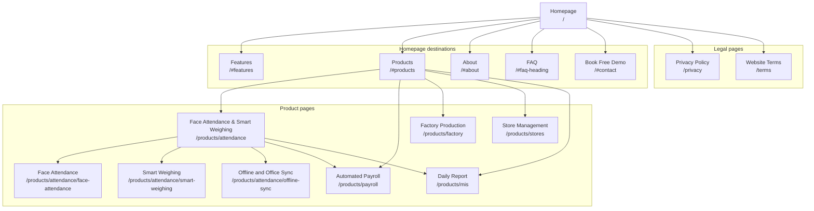
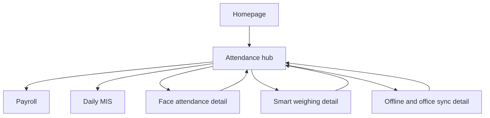

# GardenSuite Internal Site Map

**Owner:** Sarbani Associates
**Updated:** 2026-08-04
**Purpose:** Internal page hierarchy, navigation, and linking reference
**Public XML source:** `src/routes/sitemap.xml/+server.ts`

This document records the current public hierarchy and the rules for adding future routes. All routes marked as published must have complete copy, SEO, internal links, and route-level tests.

## 1. Current public site

```text
GardenSuite Homepage (/)
├── Homepage sections
│   ├── Features (/#features)
│   ├── Products (/#products)
│   ├── About Sarbani Associates (/#about)
│   ├── Common questions (/#faq-heading)
│   └── Book Free Demo (/#contact)
├── Products
│   ├── Face Attendance & Smart Weighing (/products/attendance)
│   │   ├── Face Attendance for Tea Gardens (/products/attendance/face-attendance)
│   │   ├── Smart Weighing for Tea Gardens (/products/attendance/smart-weighing)
│   │   └── Offline Attendance and Office Sync (/products/attendance/offline-sync)
│   ├── Automated Payroll (/products/payroll)
│   ├── Factory Production (/products/factory)
│   ├── Store Management (/products/stores)
│   └── Daily Report, MIS Dashboard (/products/mis)
└── Legal
    ├── Privacy Policy (/privacy)
    └── Website Terms (/terms)
```

All 11 page routes above are indexable and included in the XML sitemap. Homepage anchors are internal destinations on `/`, not separate indexable pages.

## 2. Visual site map



## 3. Current URL map

| Page                               | URL                                    | Parent         | Header               | Footer                 | Priority        |
| ---------------------------------- | -------------------------------------- | -------------- | -------------------- | ---------------------- | --------------- |
| Homepage                           | `/`                                    | None           | Logo                 | Logo                   | Highest         |
| Features section                   | `/#features`                           | Homepage       | Direct link          | Company link           | High            |
| Products section                   | `/#products`                           | Homepage       | Product menu context | No direct section link | High            |
| About section                      | `/#about`                              | Homepage       | Direct link          | Company link           | Medium          |
| FAQ section                        | `/#faq-heading`                        | Homepage       | No                   | Company link           | Medium          |
| Contact and demo                   | `/#contact`                            | Homepage       | CTA and direct link  | Contact links          | Highest         |
| Face Attendance & Smart Weighing   | `/products/attendance`                 | Products       | Product menu         | Product column         | Highest product |
| Face Attendance for Tea Gardens    | `/products/attendance/face-attendance` | Attendance hub | Contextual hub link  | No                     | High            |
| Smart Weighing for Tea Gardens     | `/products/attendance/smart-weighing`  | Attendance hub | Contextual hub link  | No                     | High            |
| Offline Attendance and Office Sync | `/products/attendance/offline-sync`    | Attendance hub | Contextual hub link  | No                     | High            |
| Automated Payroll                  | `/products/payroll`                    | Products       | Product menu         | Product column         | High            |
| Factory Production                 | `/products/factory`                    | Products       | Product menu         | Product column         | High            |
| Store Management                   | `/products/stores`                     | Products       | Product menu         | Product column         | High            |
| Daily Report, MIS Dashboard        | `/products/mis`                        | Products       | Product menu         | Product column         | High            |
| Privacy Policy                     | `/privacy`                             | Homepage       | No                   | Legal row              | Low             |
| Website Terms                      | `/terms`                               | Homepage       | No                   | Legal row              | Low             |

## 4. Header navigation specification

Keep the public header at five decisions plus one CTA:

1. `Products`, with the five current product routes.
2. `Features`, linking to `/#features`.
3. `About`, linking to `/#about`.
4. `Contact`, linking to `/#contact`.
5. `Book Free Demo`, linking to `/#contact`.

Rules:

- The GardenSuite logo always links to `/`.
- Keep attendance detail pages out of the header. They are reached through the attendance hub and sibling links.
- Do not add a Resources or Guides item until at least three useful public resources exist.
- Keep mobile and desktop product lists in the same order.
- Keep Face Attendance & Smart Weighing first because it is the active lead product.

## 5. Footer navigation specification

### Products

- Face Attendance and Smart Weighing
- Automated Payroll
- Factory Production
- Store Management
- Daily Report

### Company

- About
- Features
- FAQ

### Contact

- WhatsApp
- Sarbani Associates email
- Book Free Demo

### Legal

- Privacy
- Terms

The footer must continue to name Sarbani Associates, Bagdogra, Siliguri.

## 6. Breadcrumb rules

Every product page uses this visible pattern:

```text
Home > Products > Product name
```

Attendance detail pages use:

```text
Home > Products > Face Attendance & Smart Weighing > Detail page
```

The visible breadcrumb and BreadcrumbList schema must match. `Products` may link to `/#products` until a public `/products` hub exists.

## 7. Attendance content cluster

### Current release

```text
Attendance hub (/products/attendance)
├── Face Attendance for Tea Gardens (/products/attendance/face-attendance)
├── Smart Weighing for Tea Gardens (/products/attendance/smart-weighing)
├── Offline Attendance and Office Sync (/products/attendance/offline-sync)
├── Automated Payroll (/products/payroll)
├── Daily Report (/products/mis)
└── Links to Book Free Demo (/#contact)
```

The hub owns the short buyer story. The detail routes own face verification, smart weighing, and offline-to-office workflows. They stay out of the header and footer to keep primary navigation short.



## 8. Published attendance detail routes

| Page                           | URL                                    | Parent         | Public navigation        | Search priority |
| ------------------------------ | -------------------------------------- | -------------- | ------------------------ | --------------- |
| Face attendance detail         | `/products/attendance/face-attendance` | Attendance hub | Contextual hub link only | High            |
| Smart weighing detail          | `/products/attendance/smart-weighing`  | Attendance hub | Contextual hub link only | High            |
| Offline and office sync detail | `/products/attendance/offline-sync`    | Attendance hub | Contextual hub link only | High            |

## 9. Internal linking plan

| Source                   | Required destination   | Recommended anchor                      | Purpose                                   |
| ------------------------ | ---------------------- | --------------------------------------- | ----------------------------------------- |
| Homepage product section | Attendance hub         | Face Attendance & Smart Weighing        | Main product discovery                    |
| Attendance hub           | Payroll                | GardenSuite tea garden payroll software | Explain downstream use of attendance data |
| Attendance hub           | MIS                    | GardenSuite daily MIS dashboard         | Explain office and owner review           |
| Attendance hub           | Face attendance detail | Face attendance for tea gardens         | Explain verified hazira and punch work    |
| Attendance hub           | Smart weighing detail  | Smart weighing for tea gardens          | Explain plucking weight workflow          |
| Attendance hub           | Offline sync detail    | Offline attendance and office sync      | Explain local saving and office review    |
| Attendance detail pages  | Hub and sibling pages  | Descriptive product page names          | Keep the cluster connected                |
| Attendance hub           | Homepage contact       | Book Free Demo                          | Primary conversion                        |
| Payroll                  | Attendance hub         | Face attendance and leaf weight records | Explain payroll inputs                    |
| MIS                      | Attendance hub         | Attendance and smart weighing records   | Explain report inputs                     |
| Factory                  | MIS                    | Daily tea garden MIS dashboard          | Connect production to owner reporting     |
| Stores                   | MIS                    | Daily tea garden MIS dashboard          | Connect stock to owner reporting          |
| Every product page       | Homepage               | Home breadcrumb                         | Return path and hierarchy                 |
| Every product page       | Homepage contact       | Book Free Demo                          | Conversion path                           |

### Attendance hub release links

The new attendance page already includes:

- Home and Products breadcrumb links.
- A descriptive link to payroll.
- A descriptive link to the daily MIS dashboard.
- Hero and final links to the contact section.
- A direct Sarbani Associates email action.
- Contextual links to all three attendance detail routes.

### Next cross-linking pass

Add a descriptive link back to attendance from payroll and MIS when those pages receive their next planned edit. Do not change them only to force a link before their copy is reviewed.

## 10. Orphan and dead-link rules

- No public page may exist without at least one inbound internal link.
- No capability item links to an unpublished route.
- No unpublished route enters the XML sitemap before it is indexable.
- No `Future detail page` label appears on the public site.
- Every public product route must link to the demo action.
- Every product route must have a visible breadcrumb and matching schema.
- Removed URLs require a 301 redirect. None are required for the current attendance rebuild because `/products/attendance` is preserved.

## 11. Page ownership

| Page group         | Content job                                        | Owner                              |
| ------------------ | -------------------------------------------------- | ---------------------------------- |
| Homepage           | Category definition, trust, product routing, demo  | Marketing and Sarbani Associates   |
| Product pages      | Explain one module and reduce purchase doubt       | Product marketing                  |
| Attendance details | Explain one deep workflow                          | Product marketing and product team |
| Guides and support | Device, setup, retry, backup, and operating detail | Product support                    |
| Legal              | Privacy, terms, and enquiry data use               | Sarbani Associates                 |

## 12. Maintenance checklist

When a route is added, changed, or removed:

- Update this internal map.
- Update header or footer only when the navigation rule calls for it.
- Update `src/routes/sitemap.xml/+server.ts` for indexable routes.
- Add or update visible breadcrumbs and BreadcrumbList schema.
- Add at least one useful inbound internal link.
- Check that all anchor text describes the destination.
- Preserve lowercase, readable, hyphenated URLs.
- Add redirects for any changed public URL.
- Verify the route is reachable within three clicks from the homepage.
